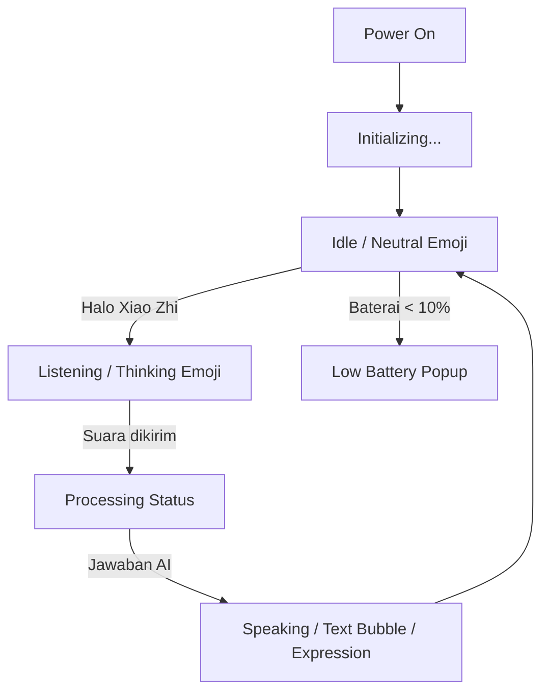

# Alur Tampilan Layar (UI Flow)

Dokumen ini menjelaskan apa saja yang ditampilkan di layar perangkat (OLED atau LCD) berdasarkan status dan interaksi pengguna.

## 1. Komponen Standar Layar
Hampir semua jenis layar memiliki pembagian area sebagai berikut:
- **Status Bar (Atas)**: Ikon WiFi (Signal), Ikon Mute (Mic), dan Indikator Baterai.
- **Header/Info (Tengah Atas)**: Label status sistem (misal: "Initializing", "Listening", "Speaking").
- **Main Content (Tengah)**: Menampilkan **Emosi/Emoji** (ikon robot atau wajah ekspresif) dan **Pesan Chat**.

---

## 2. Alur Berdasarkan Status (State-Based Flow)

| Status | Tampilan di Layar |
| :--- | :--- |
| **Initializing** | Menampilkan label "Initializing..." dan ikon Chip AI di tengah. |
| **Idle** | Menampilkan ikon ekspresi netral. Status bar menunjukkan koneksi aktif. |
| **Wake Word Detected** | Ikon berubah menjadi ekspresi "mendengarkan" (Thinking/Listening). Muncul teks "Listening...". |
| **Listening** | Menampilkan teks transkripsi suara Anda secara real-time (STT) jika didukung server. |
| **Speaking** | Menampilkan teks jawaban dari AI. Teks ini biasanya berjalan (scrolling) jika terlalu panjang. Ikon emosi berubah sesuai konteks (Senang, Sedih, Serius). |
| **Executing Tool (MCP)** | Seringkali muncul notifikasi atau indikator bahwa robot sedang melakukan aksi (misal: "Moving..."). |
| **Low Battery** | Muncul popup peringatan "Battery low, please charge!". |

---

## 3. Perbedaan Tipe Layar

### A. Layar OLED (Kecil - 128x64 / 128x32)
- **Tampilan Minimalis**: Fokus pada teks satu baris dan ikon mono-color.
- **Scrolling Text**: Karena ruang terbatas, teks chat akan berjalan secara sirkular (marquee).
- **Layout**: 128x64 menggunakan layout vertikal (Top bar, Emoji, Chat), sedangkan 128x32 menggunakan layout horizontal (Emoji kiri, Teks kanan).

### B. Layar LCD (Besar - Warna)
- **WeChat Style**: Pesan ditampilkan dalam bentuk "bubble" percakapan.
    - **User**: Bubble hijau di sebelah kanan.
    - **Assistant**: Bubble abu-abu di sebelah kiri.
    - **System**: Teks di tengah.
- **Image Preview**: Jika menggunakan tool kamera, hasil foto akan tampil di dalam bubble chat sebagai preview.
- **Tema**: Mendukung tema **Light** (Putih) dan **Dark** (Hitam).
- **GIF/Animasi**: Mendukung tampilan emoji dalam format GIF atau animasi LVGL yang lebih kaya warna.

---

## 4. Pemetaaan File UI
- **Logika Utama**: `main/display/display.cc`
- **UI OLED**: `main/display/oled_display.cc`
- **UI LCD (LVGL)**: `main/display/lcd_display.cc` (khususnya fungsi `SetChatMessage` dan `SetEmotion`).
- **Emoji/Emote**: `main/display/emote_display.cc` dan `main/display/emoji_collection.h`.

