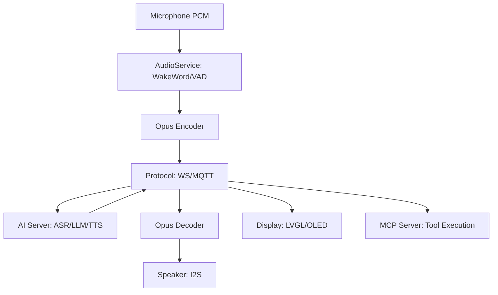

# Alur Data (Data Flow)

Dokumen ini menjelaskan bagaimana data mengalir melalui sistem, dari deteksi suara hingga respon audio.

## 1. Tahap Input (Voice Intake)
1.  **Microphone**: Menangkap audio mentah (PCM).
2.  **AudioService**: Menerima PCM dan meneruskannya ke **WakeWord detection** (ESP-SR).
3.  **Wake Word Detected**: Jika kata pemicu (misal: "Xiao Zhi") terdeteksi, `Application` berpindah ke mode `kDeviceStateListening`.
4.  **VAD (Voice Activity Detection)**: Menentukan kapan pengguna mulai dan berhenti bicara.
5.  **Encoding**: Audio pengguna dienkode menggunakan **OPUS** di `AudioService`.

## 2. Tahap Transmisi (Communication)
1.  **Protocol (WebSocket/MQTT)**: Mengirim paket audio OPUS yang sudah dienkode ke AI Server secara streaming.
2.  **MCP Context**: Perangkat juga mengirimkan daftar tool yang tersedia (capabilities) ke server sehingga AI tahu apa yang bisa dikontrol (misalnya lampu atau layar).

## 3. Tahap Pemrosesan Cloud (Cloud Processing)
1.  **ASR (Automatic Speech Recognition)**: Mengubah suara menjadi teks.
2.  **LLM (Large Language Model)**: Memproses teks dan menentukan jawaban atau panggilan tool (MCP Tool Call).
3.  **TTS (Text to Speech)**: Mengubah jawaban teks menjadi stream audio (biasanya OPUS).

## 4. Tahap Output (Response)
1.  **Incoming JSON**: `Protocol` menerima pesan JSON yang mengandung:
    -   `stt`: Teks hasil pengenalan suara (untuk ditampilkan di layar).
    -   `tts`: Sinyal bahwa stream audio respon dimulai.
    -   `llm`: Informasi emosi untuk diperbarui di UI.
    -   `mcp`: Panggilan tool (misal: "nyalakan lampu").
2.  **Incoming Audio**: Data audio OPUS diterima secara streaming.
3.  **Demuxer & Decoding**: `OggDemuxer` mengurai paket, dan decoder OPUS mengubahnya kembali menjadi PCM.
4.  **AudioCodec**: Data PCM dikirim ke hardware speaker (via I2S).
5.  **Display Update**: Layar (OLED/LCD) diperbarui secara real-time berdasarkan pesan JSON (menampilkan teks assistant dan emosi).

